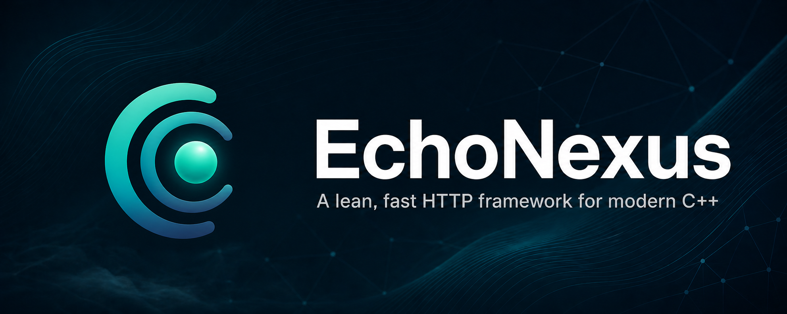

<p align="center">
  
</p>

<p align="center">
  <strong>A lean, fast HTTP framework for modern C++</strong>
</p>

<p align="center">
  <a href="LICENSE"></a> &nbsp;
  <a href="#"></a> &nbsp;
  <a href="#"></a> &nbsp;
  <a href="https://github.com/Cosmic-Stars-Team/EchoNexus"></a>
</p>

---

EchoNexus is a coroutine-first HTTP framework written in C++23. It's built on Boost.Beast and designed to be fast, light on resources, and straightforward to use — no code generation, no magic annotations, just plain C++ that does what you'd expect.

If you've used Express, Koa, or Axum before, the middleware-and-router model should feel familiar. Handlers are coroutines; middleware is just a handler that can choose to call the next one (or not). The whole thing compiles down to a single native binary that sips memory.

---

## Quick start

You'll need:

- A **C++23** compiler (Clang 19+, GCC 15+, or MSVC 19.40+)
- **CMake 3.25** or newer
- **[Just](https://just.systems) 1.50+** — the project uses it as a command runner

Clone and run:

```bash
git clone https://github.com/Cosmic-Stars-Team/EchoNexus.git
cd EchoNexus
just run
```

Then open [http://127.0.0.1:9000](http://127.0.0.1:9000). You should see "Hello, World!".

Play with the example routes:

```bash
curl http://127.0.0.1:9000/
curl http://127.0.0.1:9000/api/info
curl http://127.0.0.1:9000/api/v1/user/42
curl http://127.0.0.1:9000/api/v1/user/42/info
```

> **Windows users**: Open a **Developer Command Prompt for VS**, then use the same `just` commands. MSVC is fully supported.
>
> ```cmd
> cd EchoNexus
> just build          # debug build
> just build --release
> just run            # build & run the example
> just test           # run the full test suite
> ```

---

## What it looks like

Here's a taste — the example that ships in `example/src/main.cpp`:

```cpp
#include <middlewares/logger.hpp>
#include <middlewares/router.hpp>
#include <serve.hpp>
#include <types/request.hpp>
#include <types/response.hpp>

auto main() -> int {
    echo::net::io_context ioc(1);
    echo::nexus app(std::make_unique<echo::beast_executor>());

    echo::middlewares::router root;

    // Log every request
    root.use(echo::middlewares::logger);

    // GET /
    root.get("/", [](echo::type::request_ptr, std::optional<echo::next_fn_t>)
        -> echo::awaitable<echo::type::response> {
        co_return echo::type::response::text("Hello, World!", 200);
    });

    // Nested routes under /api
    echo::middlewares::router api;
    api.get("/info", [](echo::type::request_ptr req, std::optional<echo::next_fn_t>)
        -> echo::awaitable<echo::type::response> {
        std::unordered_map<std::string, std::string> data = {
            {"name", "EchoNexus"},
            {"version", "0.0.0"}
        };
        co_return echo::type::response::json(data);
    });
    root.nest("/api", api);

    echo::net::co_spawn(ioc, app.serve(/*port=*/9000), [&ioc](std::exception_ptr ep) {
        // ... error handling ...
    });

    ioc.run();
}
```

Handlers are C++ coroutines. The router supports path parameters (`/user/{uid}`), middleware layering (per-route or per-group), and fallback handlers. No codegen, no reflection — just `co_await` and `co_return`.

---

## Using EchoNexus in your project

The simplest way right now is to vendor EchoNexus and add it with `add_subdirectory`:

```cmake
cmake_minimum_required(VERSION 3.25)
project(MyApp LANGUAGES CXX)

add_subdirectory(third_party/EchoNexus)

add_executable(my_app src/main.cpp)
target_link_libraries(my_app PRIVATE EchoNexus::EchoNexus)
target_compile_features(my_app PRIVATE cxx_std_23)
```

When you use `add_subdirectory`, you own dependency discovery — make sure `Boost` and `glaze` are findable (typically via `CMAKE_TOOLCHAIN_FILE`). EchoNexus only auto-bootstraps a local `vcpkg` checkout when it's built as the top-level project.

---

## Running tests

```bash
just clean                    # wipe CMake caches and build artifacts
just build                    # build the library + example
just test                     # run the full suite (unit + integration)
just test unit                # unit tests only
just test integration         # integration tests only
```

Flags you might care about:

| flag               | what it does                                                      |
| ------------------ | ----------------------------------------------------------------- |
| `--release`        | Build and test against the release config (default is debug)      |
| `--compiler <cxx>` | Use a specific compiler, e.g. `--compiler clang++-20` or `g++-15` |
| `--export <path>`  | Write JUnit XML, e.g. `--export ./test-results.xml`               |

---

## Benchmarks

We run a cross-framework benchmark suite against FastAPI, Flask, Koa, Elysia, Axum, Gin, and Spring Boot. The latest run was **2026-04-30 on an M4 Pro MacBook (macOS 26, 14 cores, 24 GB RAM)**. The tested EchoNexus version is **0.1.0**.

Every test uses HTTP/1.1 over `127.0.0.1`, no TLS, no compression. Each workload gets 10 seconds of warmup, 30 seconds of measurement.

Here's **plaintext** — EchoNexus at its best (4 workers):

| Framework     | QPS (c=500) | QPS (c=2000) |  Peak RSS |
| ------------- | ----------: | -----------: | --------: |
| **EchoNexus** |     151,863 |  **163,008** | **26 MB** |
| Axum          |     148,494 |      145,827 |     85 MB |
| Gin           |     144,242 |      133,135 |     78 MB |
| Koa           |     147,916 |      133,209 |    804 MB |
| Spring Boot   |     131,726 |      113,829 |    401 MB |
| FastAPI       |      23,678 |       15,906 |    325 MB |
| Flask         |       7,957 |        8,148 |     24 MB |

And **time_json** — per-request timestamp generation plus JSON serialization. On a single worker, EchoNexus sits behind Axum and Elysia:

| Framework     | QPS (c=500) | QPS (c=2000) |  Peak RSS |
| ------------- | ----------: | -----------: | --------: |
| Axum          |     133,589 |  **149,495** |     85 MB |
| Elysia        |     134,615 |      134,348 |     80 MB |
| **EchoNexus** |      93,917 |       89,653 | **11 MB** |
| Gin           |      95,250 |       90,355 |     76 MB |
| Koa           |      73,543 |       68,848 |    255 MB |
| Spring Boot   |      55,334 |       53,815 |    350 MB |
| FastAPI       |       5,760 |        4,178 |    106 MB |
| Flask         |          79 |          394 |     27 MB |

The memory story is consistent either way — EchoNexus idles under 5 MB and stays lean under load, while putting up competitive or leading numbers depending on the workload.

> **Caveats**: This is pre-release software — the numbers are a checkpoint, not a finish line. More importantly, cross-framework benchmarks always carry some degree of unfairness: differences in language runtimes, concurrency models, and serialization paths mean these comparisons are approximate at best. If you spot methodology issues or ways to make the comparisons fairer, contributions are very welcome.

### Run it yourself

```bash
just benchmark smoke
just benchmark --frameworks echonexus,axum --workloads plaintext,json --workers 1,4 --release
```

Full details in [`benchmarks/GUIDE.md`](benchmarks/GUIDE.md). The runner handles setup, build, and teardown for each framework — you just need the toolchains installed.

---

## License

EchoNexus is open source under the [BSD 3-Clause License](LICENSE). © 2026 Cosmic Stars Team.

---

## Contributing

EchoNexus is in early development, and contributions are welcome. Found a bug, have a feature idea, or want to add a benchmark? Open an issue or pull request on [GitHub](https://github.com/Cosmic-Stars-Team/EchoNexus).
